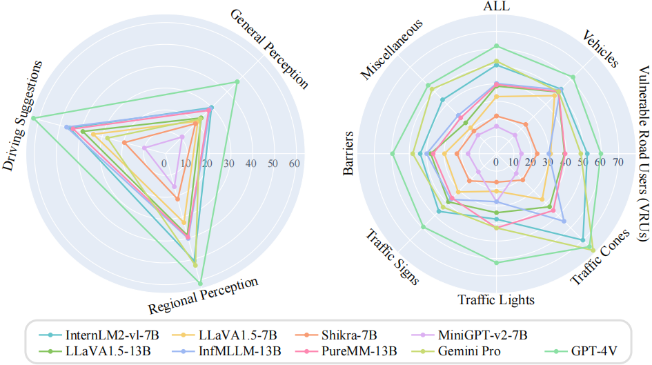

# CODA-LM
[](https://arxiv.org/abs/2404.10595) [](https://coda-dataset.github.io/coda-lm/)

This repository contains the implementation of the paper:

> Automated Evaluation of Large Vision-Language Models on Self-driving Corner Cases <br>
> [Yanze Li]()\*, [Wenhua Zhang]()\*, [Kai Chen](https://kaichen1998.github.io)\*, [Yanxin Liu](), [Pengxiang Li](https://scholar.google.com/citations?user=rUp_4RgAAAAJ&hl=en), [Ruiyuan Gao](https://gaoruiyuan.com/), [Lanqing Hong](https://scholar.google.com.sg/citations?user=2p7x6OUAAAAJ&hl=en), [Meng Tian](), [Xinhai Zhao](), [Zhenguo Li](https://scholar.google.com/citations?user=XboZC1AAAAAJ&hl=en&oi=ao), [Dit-Yan Yeung](https://sites.google.com/view/dyyeung), [Huchuan Lu](https://scholar.google.com/citations?user=D3nE0agAAAAJ&hl=en), [Xu Jia](https://stephenjia.github.io/)† <br>
> *Equal Contribution   †Corresponding Author




## Data Preparation

The instructions for downloading CODA-LM are listed as follows:

1. Download the image files following the CODA official instructions [here](https://coda-dataset.github.io/download.html#instructions)
2. Download the CODA-LM annotation files and then decompress them in the same root directory.

| Split | Size | Image Source  |  Download  |
| :---: | :--: | :-----------: | :--------: |
| Train | 4884 | CODA2022 val  | [HF Hub]() |
|  Val  | 4384 | CODA2022 test | [HF Hub]() |
| Test  | 500  | CODA2022 test | [HF Hub]() |
| Mini  |  50  | CODA2022 test | [HF Hub](https://huggingface.co/datasets/KaiChen1998/coda-lm/tree/main/CODA-LM/Mini) |


Note that:

1. Images of **CODA-LM train** set come from **CODA2022 val** set, while images of **CODA-LM val and test** sets come from **CODA2022 test** set.

2. **CODA-LM mini** set is a 50-image subset of **CODA-LM val** set for demonstration.

After decompression, the data organization is listed as follows:

```
├── val                    -- CODA2022 val (we only use images)
│   │── images
│   │   │── *_*.jpg
├── test                   -- CODA2022 test (we only use images)
│   │── images
│   │   │── *_*.jpg
├── CODA-LM
│   │── Train              -- CODA-LM train (we use 4884 images from CODA2022 val)
│   │   │── val_*.json
│   │── Val                -- CODA-LM val (we use 4384 images from CODA2022 test)
│   │   │── test_*.json
│   │── Test               -- CODA-LM test (we use 500 images from CODA2022 test)
│   │   │── test_*.json
│   │── Mini               -- CODA-LM mini (a 50-image subset of CODA-LM val)
│   │   │── test_*.json
```


## Data Format

The annotation files contains question-answering pairs for all three tasks as following,

```
{
    "general_perception":{
        "vehicles": [
            {
                "description": <str>,
                "explanation": <str>"
            },
        "vulnerable_road_users": [...],
        "traffic signs": [...],
        "traffic lights": [...],
        "traffic cones": [...],
        "barriers": [...],
        "other objects": [...],
    },
    "region_perception":{
        "1": {
            "description and explanation": <str>,
            "box": <list of float>,
            "category_name": <str>
        },
        "2": {...},
        "3": {...}
    },
    "driving_suggestion": <str>,
}
```


## Check Yourself!


## Citation

```bibtex
@article{li2024automated,
  title={Automated Evaluation of Large Vision-Language Models on Self-driving Corner Cases},
  author={Li, Yanze and Zhang, Wenhua and Chen, Kai and Liu, Yanxin and Li, Pengxiang and Gao, Ruiyuan and Hong, Lanqing and Tian, Meng and Zhao, Xinhai and Li, Zhenguo and others},
  journal={arXiv preprint arXiv:2404.10595},
  year={2024}
}
```

