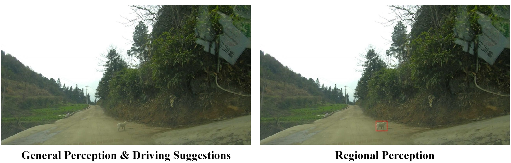

# CODA-LM
[](https://arxiv.org/abs/2404.10595) [](https://coda-dataset.github.io/coda-lm/) [](https://huggingface.co/datasets/KaiChen1998/coda-lm)

This repository contains the implementation of the paper:

> Automated Evaluation of Large Vision-Language Models on Self-driving Corner Cases <br>
> [Kai Chen](https://kaichen1998.github.io)\*, [Yanze Li]()\*, [Wenhua Zhang]()\*, [Yanxin Liu](), [Pengxiang Li](https://scholar.google.com/citations?user=rUp_4RgAAAAJ&hl=en), [Ruiyuan Gao](https://gaoruiyuan.com/), [Lanqing Hong](https://scholar.google.com.sg/citations?user=2p7x6OUAAAAJ&hl=en)†, [Meng Tian](), [Xinhai Zhao](), [Zhenguo Li](https://scholar.google.com/citations?user=XboZC1AAAAAJ&hl=en&oi=ao), [Dit-Yan Yeung](https://sites.google.com/view/dyyeung), [Huchuan Lu](https://scholar.google.com/citations?user=D3nE0agAAAAJ&hl=en), [Xu Jia](https://stephenjia.github.io/)† <br>
> *Equal Contribution   †Corresponding Author
> <br>*IEEE/CVF Winter Conference on Applications of Computer Vision (WACV)*, 2025

<p align="center">
  
</p>

## Update

- **2024.10**: CODA-LM Test set annotations have been released on [HuggingFace](https://huggingface.co/datasets/KaiChen1998/coda-lm/tree/main/CODA-LM/Test)!

## Data Preparation

The instructions for downloading CODA-LM are listed as follows:

1. Download the image files following the CODA official instructions [here](https://coda-dataset.github.io/download.html#instructions)
2. Download the CODA-LM annotation files and then decompress them in the same root directory.

| Split | Size | Image Source  |  Download  |
| :---: | :--: | :-----------: | :--------: |
| Train | 4884 | CODA2022 val  | [HF Hub](https://huggingface.co/datasets/KaiChen1998/coda-lm) |
|  Val  | 4384 | CODA2022 test | [HF Hub](https://huggingface.co/datasets/KaiChen1998/coda-lm) |
| Test  | 500  | CODA2022 test | [HF Hub](https://huggingface.co/datasets/KaiChen1998/coda-lm) |
| Mini  |  50  | CODA2022 test | [HF Hub](https://huggingface.co/datasets/KaiChen1998/coda-lm) |

Note that:

1. Images of **CODA-LM train** set come from **CODA2022 val** set, while images of **CODA-LM val and test** sets come from **CODA2022 test** set.
2. **CODA-LM mini** set is a 50-image subset of **CODA-LM val** set for demonstration.

After decompression, the data organization is listed as follows:

```
├── val                    -- CODA2022 val (we only use images)
│   │── images
│   │   │── *.jpg
├── test                   -- CODA2022 test (we only use images)
│   │── images
│   │   │── *.jpg
├── CODA-LM
│   │── Train              -- CODA-LM train (we use 4884 images from CODA2022 val)
│   │   │── val_*.json
│   │── Val                -- CODA-LM val (we use 4384 images from CODA2022 test)
│   │   │── test_*.json
│   │── Test               -- CODA-LM test (we use 500 images from CODA2022 test)
│   │   │── test_*.json
│   │── Mini               -- CODA-LM mini (a 50-image subset of CODA-LM val)
│   │   │── test_*.json
```


## Data Format

The annotation files contains question-answering pairs for all three tasks as following,

```
{
    "general_perception":{
        "vehicles": [                             -- list containing information on all vehicles
            {
                "description": <str>,             -- description about a single vehicle
                "explanation": <str>"             -- explanation why it affects the ego car
            },
        "vulnerable_road_users": [...],           -- list containing information on all VRUs
        "traffic signs": [...],                   -- list containing information on all traffic signs
        "traffic lights": [...],                  -- list containing information on all traffic lights
        "traffic cones": [...],                   -- list containing information on all traffic cones
        "barriers": [...],                        -- list containing information on all barriers
        "other objects": [...],                   -- list containing information on all other objects
    	"description and explanation": <str>      -- summarization of information on all categories
    },
    "region_perception":{
        "1": {                                    -- region index
            "description and explanation": <str>, -- description of road users in the specific region with explanation on why it affects the ego car
            "box": <list of float>,               -- xywh coordinates
            "category_name": <str>                -- object category
        },
        "2": {...},
        "3": {...}
    },
    "driving_suggestion": <str>,
}
```

## Data Usage
To help users better understand the structure of CODA-LM, we provide a python script to convert our annotations to basic VQA formats, as follows:

1. Download the data and make sure the directory organization follows [Data Prepration](https://github.com/DLUT-LYZ/CODA-LM?tab=readme-ov-file#data-preparation).

2. Run `convert2vqa.py` as follows:

   ```bash
   # English
   python convert2vqa.py --coda_root $CODA_ROOT --codalm_ann_name CODA-LM
   
   # Chinese
   python convert2vqa.py --coda_root $CODA_ROOT --codalm_ann_name CODA-LM-chinese
   ```

3. After that, the resulting data organization will be like this:

   ```
   ├── val
   │   │── images
   │   │── images_w_bboxes                  -- Images with bboxes drawn for region perception
   │   │   │── *.jpg
   ├── test
   │   │── images
   │   │── images_w_bboxes                  -- Images with bboxes drawn for region perception
   │   │   │── *.jpg
   ├── CODA-LM
   │   │── Train
   │   │   │── vqa_anno
   │   │   │   │── general_perception.jsonl  -- VQA annotations for general perception
   │   │   │   │── region_perception.jsonl   -- VQA annotations for region perception
   │   │   │   │── driving_suggestion.jsonl  -- VQA annotations for driving suggestion
   │   │── Val
   │   │   │── vqa_anno
   │   │── Test
   │   │   │── vqa_anno
   │   │── Mini
   │   │   │── vqa_anno
   ```

4. The basic VQA format saves data sample simply with a dictionary containing `question_id`, `image`, `question`, and `answer`, as follows:

   ```
   {"question_id": 0, "image": val/images/0001.jpg, "question": <str>, "answer": <str>}
   {"question_id": 1, "image": val/images/0002.jpg, "question": <str>, "answer": <str>}
   {"question_id": 2, "image": val/images/0003.jpg, "question": <str>, "answer": <str>}
   ...
   ```

5. Note that for regional perception, there are various possible manners to utilize the bbox annotations. Here we provide a simple implementation by drawing the bboxes with red rectangles on images, which are saved in the `images_w_bboxes` directory.

   


## Data Annotation

Check [CODA-LM Annotation Tool](./labeling) for more details.


# Evaluation

Check [CODA-LM Evaluation](./evaluation) for more details.


## Citation

```bibtex
@article{li2024automated,
  title={Automated Evaluation of Large Vision-Language Models on Self-driving Corner Cases},
  author={Li, Yanze and Zhang, Wenhua and Chen, Kai and Liu, Yanxin and Li, Pengxiang and Gao, Ruiyuan and Hong, Lanqing and Tian, Meng and Zhao, Xinhai and Li, Zhenguo and others},
  journal={arXiv preprint arXiv:2404.10595},
  year={2024}
}
```

